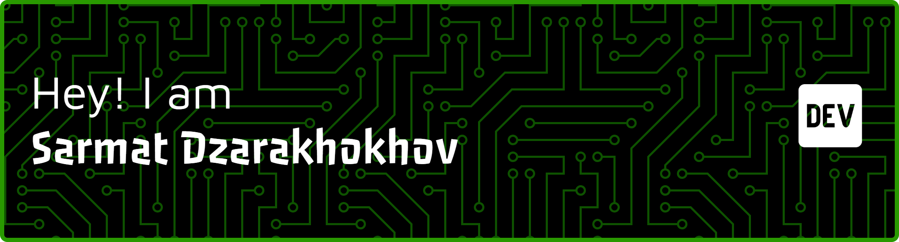

<!-- Gradient banner (SVG) -->

  

<!-- Tech icons -->

  

---

### 👨‍💻 About me
- **Focus:** high-performance interfaces, DX, clarity  
- **Tools:** TypeScript, Go, Rust, Edge-runtime, WASM  
- **Now:** building a design system and code generators  

---

### 📊 Stats and trophies

  

  

---

### 🛠 Projects
🎰 [Rust-Themed Casino Wheel](https://github.com/sarmatdzar/rust-roulette) 27.10.2025

---

### 📬 Contact
- **Email:** sarmatdzarachochow@gmail.com
- **Meetups:** Warsaw
